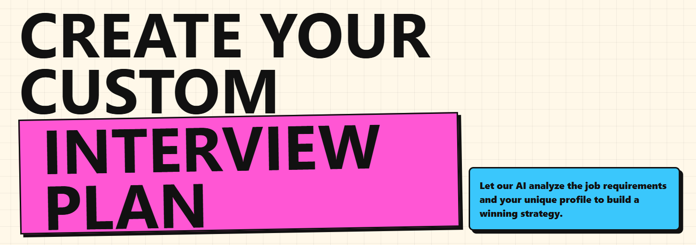
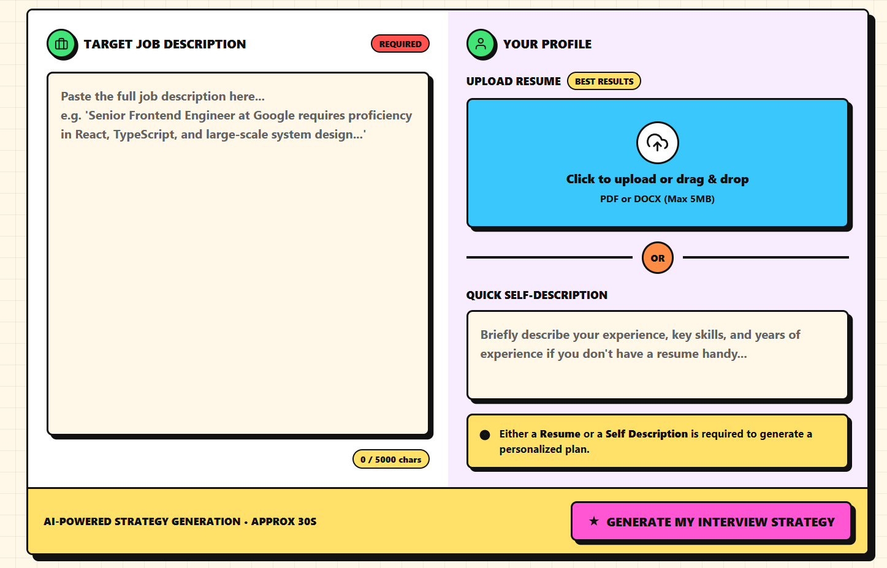
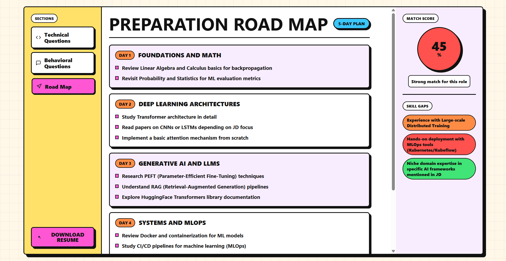

# 🚀 ResumePilot

> AI-Powered Resume Analysis & Interview Preparation Platform

ResumePilot helps job seekers bridge the gap between their current profile and their dream role.

Simply upload your resume (or provide a self-description), paste a target job description, and let AI generate a personalized interview preparation strategy, skill-gap analysis, interview questions, and a tailored resume.

---

## 🌟 Demo Preview

### Landing Page



### Resume Upload & Job Description Analysis



### AI Generated Preparation Roadmap



---

## ✨ Features

### 🎯 Job Match Analysis

Compare a candidate's profile against a target job description and receive an AI-generated compatibility score.

### 📊 Skill Gap Detection

Identify missing technologies, frameworks, experiences, and qualifications required for the target role.

### 🎤 Interview Preparation

Generate role-specific:

* Technical Questions
* Behavioral Questions
* Scenario-Based Questions

### 🗺️ Personalized Roadmap

Receive a structured multi-day preparation plan tailored to the selected role.

Example:

* Foundations & Core Concepts
* Advanced Technical Topics
* Generative AI / Domain Knowledge
* System Design & Deployment
* Mock Interview Preparation

### 📄 AI Resume Generation

Generate an optimized resume tailored specifically to the job description.

### 🔐 Authentication System

Secure user authentication using JWT.

### 📁 Resume Upload

Supports resume uploads for profile extraction and analysis.

---

## 🏗️ System Workflow

```text
User Resume / Self Description
            │
            ▼
Target Job Description
            │
            ▼
Google Gemini AI Analysis
            │
 ┌──────────┼──────────┐
 ▼          ▼          ▼
Match      Skill      Interview
Score      Gaps       Questions
 │
 ▼
Preparation Roadmap
 │
 ▼
Tailored Resume PDF
```

---

## 🛠️ Tech Stack

### Frontend

* React.js
* Vite
* SCSS
* Responsive UI Design

### Backend

* Node.js
* Express.js

### Database

* MongoDB

### Authentication

* JWT (JSON Web Tokens)

### AI

* Google Gemini API

### PDF Generation

* Puppeteer

---

## 📂 Project Structure

```text
ResumePilot
│
├── client
│   ├── public
│   ├── src
│   │   ├── components
│   │   ├── pages
│   │   ├── services
│   │   ├── styles
│   │   └── utils
│
├── server
│   ├── controllers
│   ├── routes
│   ├── middleware
│   ├── models
│   ├── services
│   └── config
│
├── README.md
└── package.json
```

---

## ⚙️ Installation

### Clone Repository

```bash
git clone https://github.com/VishalVab01/ResumePilot.git
cd ResumePilot
```

### Install Dependencies

Frontend

```bash
cd client
npm install
```

Backend

```bash
cd server
npm install
```

---

## 🔑 Environment Variables

Create a `.env` file inside the server directory.

```env
PORT=5000

MONGODB_URI=your_mongodb_connection_string

JWT_SECRET=your_jwt_secret

GEMINI_API_KEY=your_gemini_api_key
```

---

## ▶️ Run Locally

Backend

```bash
npm run dev
```

Frontend

```bash
npm run dev
```

Open:

```text
http://localhost:5173
```

---

## 🎯 Key Learning Outcomes

This project provided hands-on experience with:

* Full-Stack Application Development
* REST API Design
* JWT Authentication
* File Upload Handling
* MongoDB Data Modeling
* Google Gemini API Integration
* Prompt Engineering
* PDF Generation with Puppeteer
* Building Production-Style User Workflows

---

## 🚀 Future Improvements

* ATS Optimization Score
* Cover Letter Generation
* AI Mock Interview Assistant
* Voice-Based Interview Practice
* LinkedIn Profile Analysis
* Job Recommendation Engine
* Multiple Resume Templates
* Resume Version Management

---

## 🤝 Contributing

Contributions, issues, and feature requests are welcome.

1. Fork the repository
2. Create a feature branch
3. Commit changes
4. Push to your branch
5. Open a Pull Request

---

## 👨‍💻 Author

**Vishal Vaibhav**

GitHub: https://github.com/VishalVab01

If you found this project useful, consider giving it a ⭐.
